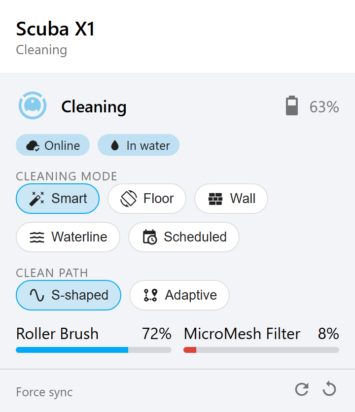
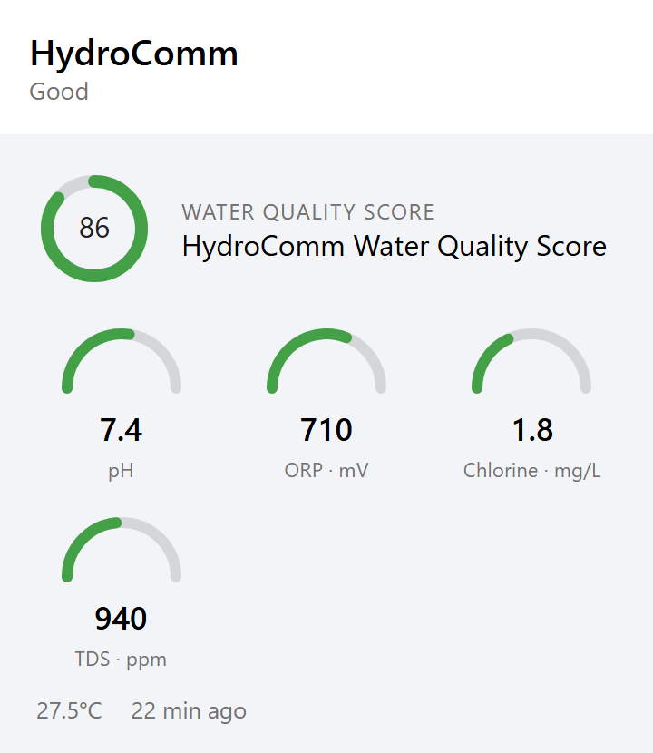

# Aiper Pool Cleaner Card

Lovelace cards for the [**ha-aiper**](https://github.com/kmich/ha-aiper) integration
(Aiper pool cleaners and HydroComm water-quality monitors).

Two cards in one bundle:

| Card | For | Shows |
|---|---|---|
| `custom:aiper-cleaner-card` | Scuba / Surfer / Shark cleaners | Status + battery, online / in-water / solar pills, warning banner, cleaning-mode chips, clean-path chips, start/stop (Surfer), consumable wear bars, force-sync buttons |
| `custom:aiper-monitor-card` | HydroComm / HydroComm Pro | Water-quality score ring, pH / ORP / chlorine / TDS / EC arc gauges, water temperature, sample age, alarm banner |

Both cards are **device-driven**: point them at an Aiper device and they find the
right entities themselves, including ones renamed in the entity registry. They
follow the active Home Assistant theme (light and dark) and have a visual editor.

<p>
  
  
</p>

<sub>Screenshots from `demo/index.html`; icons are supplied by Home Assistant's icon set in a real install.</sub>

> This is a frontend companion to the integration; it is not affiliated with Aiper.

---

## Installation

### HACS

1. HACS is required for the [`ha-aiper`](https://github.com/kmich/ha-aiper)
   integration too — install that first.
2. HACS → three-dot menu → **Custom repositories** → add
   `https://github.com/kmich/ha-aiper-card` with category **Dashboard**.
3. Install **Aiper Pool Cleaner Card** and reload your browser.
4. HACS adds the dashboard resource automatically. If you use YAML-mode
   dashboards, add it yourself:

   ```yaml
   lovelace:
     resources:
       - url: /hacsfiles/ha-aiper-card/aiper-card.js
         type: module
   ```

### Manual

1. Download `aiper-card.js` from the
   [latest release](https://github.com/kmich/ha-aiper-card/releases).
2. Copy it to `config/www/aiper-card.js`.
3. Add the resource: **Settings → Dashboards → three-dot menu → Resources → Add**,
   URL `/local/aiper-card.js`, type **JavaScript Module**.

---

## Usage

Add a card, search for **Aiper**, pick the device in the editor. Or in YAML:

```yaml
type: custom:aiper-cleaner-card
device: 1a2b3c4d5e6f...        # Aiper cleaner device id
```

```yaml
type: custom:aiper-monitor-card
device: 9f8e7d6c...            # HydroComm device id
gauges: [ph, orp, chlorine, tds]
```

See [`examples/`](examples/) for a full view and for pinning entities by hand.

### `aiper-cleaner-card` options

| Option | Default | Description |
|---|---|---|
| `device` | – | Aiper cleaner device id. Preferred way to bind the card. |
| `entity` | – | Alternative to `device`: any entity of the cleaner; the rest is derived from its device. |
| `entities` | – | Map of `slot: entity_id` overrides (see [`examples/entity-overrides.yaml`](examples/entity-overrides.yaml)). Wins over auto-detection. |
| `name` | device name | Header title. |
| `image` | integration picture | Header image URL. |
| `compact` | `false` | Hide the header image. |
| `show_mode` | `true` | Cleaning-mode chip row. |
| `show_clean_path` | `true` | Clean-path chip row (only if the entity exists). |
| `show_consumables` | `true` | Consumable wear bars (only if any exist and are enabled). |
| `show_footer` | `true` | Force-sync (shadow / metadata) buttons. |

### `aiper-monitor-card` options

| Option | Default | Description |
|---|---|---|
| `device` | – | HydroComm device id. |
| `entity` / `entities` | – | Same override mechanism as the cleaner card. |
| `name` | device name | Header title. |
| `gauges` | `[ph, orp, chlorine]` | Any of `ph`, `orp`, `chlorine`, `tds`, `ec`, in display order. |
| `show_score` | `true` | Overall water-quality score ring. |
| `show_meta` | `true` | Water temperature and sample age. |

The healthy/warning bands drawn on the gauges are general pool guidance, not
advice — calibrate to your own water.

---

## How entity detection works

1. `entities:` overrides from the card config, if any.
2. The device's `unique_id`s (`<serial>_<key>`) from the entity registry —
   survives renaming the entity. Needs a logged-in user who can read the
   registry.
3. Failing that, an `entity_id` suffix match scoped to the device.

If a card shows "No Aiper … entities found", check the `device` id, or pin the
entities explicitly.

---

## Development

```bash
npm install
npm run build      # -> dist/aiper-card.js
npm run watch      # rebuild on change
npm run lint
```

Regenerate the README screenshots (serve the repo root on :8779 first):

```bash
npm i --no-save playwright && npx playwright install chromium
node demo/shot.mjs
```

`dist/aiper-card.js` is committed so manual installs and pre-release HACS installs
work; CI fails if it is out of date. Tagging a release stamps the version and
attaches the bundle.

## License

MIT
